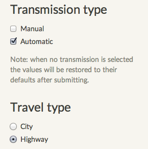
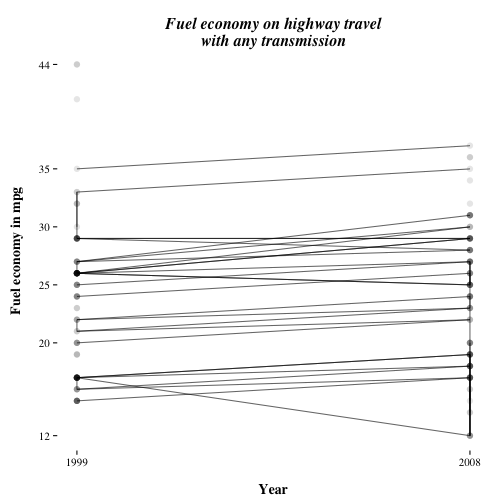

A fuel economy surveyor
========================================================
author: E.N.
date: September 2015
transition: fade
width: 1200
height: 800

<div class="midcenter" style="margin-left:-100px; margin-top:-50px;">
</img>
</div>

Idea
========================================================
type: mine
Create a basic Shiny app on the ggplot2 mpg data set where
the user can filter on:

1. Transmission type (select at least 1)
    + Manual
    + Automatic
1. Traffic type (select only 1)
    + City traffic
    + Highway travel
    
The total average fuel economy will be calculated.

Example
========================================================
type: mine
left: 25%

<div>
</img>
</div>
***


```r
# library calls & preprocessing
# omitted for brevity
filter(dt, trans=="auto") %>% 
        group_by(year)    %>%
        summarise(mean(hwy))
```

```
Source: local data table [2 x 2]

   year mean(hwy)
  (int)     (dbl)
1  1999  22.13514
2  2008  22.43373
```

      
## But wait, there's more...

A slope graph!
========================================================
type: mine
left: 65%

 
***

The Shiny app has a tab panel 'Plot' with a slope graph that also updates based on the user's filtering.
> <small>In the next version there will be no line crossings anymore</small>

Test yourself
========================================================
type: mine

<br>

You can run this Shiny app yourself at:

> [Fuel economy surveyor](https://d8a-sci.shinyapps.io/fuelsurvey)

<pre>
https://d8a-sci.shinyapps.io/fuelsurvey
</pre>
      
Try it now! It's free.

